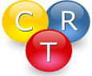

#  Chemical Reactor Design Toolbox

## Introduction and Motivation

A fundamental knowledge and a basic understanding of the interactions
between chemical reactions and various transport processes is
essential for a proper design of chemical reactors and related
processes. However, presenting those fundamentals has been difficult
to present in the classroom to motivate students to rise to the
challenges. Therefore the Chemical Reactor Design Toolbox was
developed to provide a tool to address the challenge through an
innovative, creative and playful approach.

The toolbox is implemented as a new custom library for the
MATLAB/Simscape framework consisting of basic blocks. Each block
represents either a balancing control volume, a physical transport
process (for mass, heat and momentum), a source/sink due to a chemical
reaction or a thermodynamic phase equilibrium. A multicomponent
mixture of an arbitrary number of individual species is considered in
each phase (gas, solid, liquid and interface). By combining several
basic blocks into subsystems composite blocks can be defined.

Iteratively applied, hierarchical multi-scale models can be created
from scratch without the need of writing a single line of code
(no-code programming). The toolbox has been successfully applied in
chemical engineering, biochemical reaction engineering, and
electrochemical reaction engineering courses. In addition, digital
twins of actual experimental setups have been created to provide a
quasi hands-on experience for the students to train their experimental
skills without the need of placing expensive laboratory equipment at
their disposal.

## Fundamentals

The library design is based on three fundamental paradigms:
- Control Volume Approach
- Object-Oriented Modelling
- Hierarchical Systems

Maybe, the first paradigm looks very familiar to you. Actually, this
is very basic to every engineering student, because it addresses the
way engineers are going to set up balance equations of all kinds. The
very starting point for every balance equation is a formulation by
words. Since we are addressing chemical reactive system, the balance
equation shown below is given in terms of the number of moles $n_i$
for a single species $A_i$.

